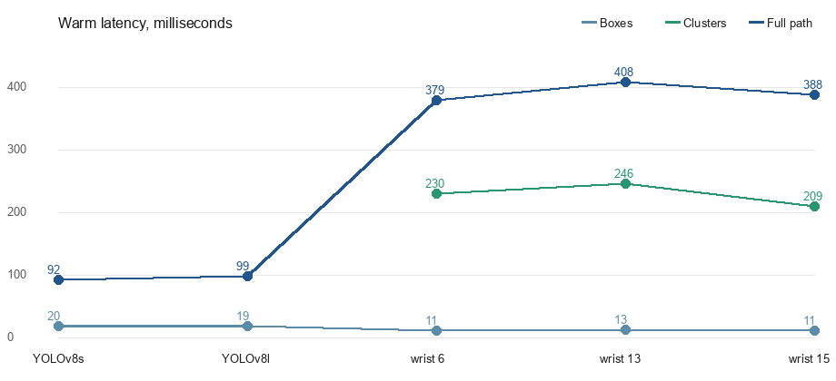

[English](README.md) | **中文**

# JEV Sees

### 给 JEV 一双眼睛。

**JEV 很会判断：快、结构化，而且天然适合做封闭式决策。**

把图片、视频流或者 RGB-D 相机接进来以后，JEV 就可以直接参与视觉世界里的判断：识别目标、估计风险、给状态打分，或者一次判断画面里的多个对象。

**一帧画面，多个对象，一次 JEV 调用。**


> 上面的 Demo 里，同一个采样帧中所有可见行人的事故风险，都由一次 JEV 调用一起返回。

**JEV 负责判断，JEV Sees 让它看见，[JEV Control](https://github.com/CharlesFeng0314/JEV_control_your_roboarm) 让它行动。**

---

## 为什么要给 JEV 加上视觉？

JEV 原本就很擅长一件事：**快速、封闭、结构化地做判断**。

choice、probability、score，这些结果很适合直接交给程序继续执行。

但没有视觉之后，很多本来很自然的问题就根本问不了：

- 这个行人现在危险吗？
- 机器人应该关注哪个物体？
- 目标的状态有没有发生变化？
- 画面里哪个对象最符合这个条件？
- 能不能把同一个问题一次问给这一帧里的所有人？

JEV Sees 做的就是把这扇门打开。

它让相机成为 JEV 的输入，让 JEV 不只是在文字或结构化信息上做判断，而是开始直接参与真实视觉场景里的决策。

### 和 VLM 的区别，不在于“谁会看图”

VLM 当然会看图，而且非常擅长开放式视觉理解：描述画面、解释场景、回答宽泛问题。

JEV 更有意思的地方，是当你的问题已经很明确时，你可以把视觉判断做得**更快、更结构化、更适合重复调用，也更适合并发处理很多个对象**。

| 常见 VLM 用法 | JEV Sees + JEV |
| --- | --- |
| “描述一下发生了什么” | “这一帧里每个行人危险吗？” |
| 自由文本生成 | choice / probability / score |
| 一次问一个大问题 | 一次塞进很多个封闭式问题 |
| 结果主要给人看 | 结果可以直接给程序用 |
| 更适合开放式理解 | 更适合持续重复做决策 |

这也是为什么给 JEV 加上视觉以后，它的使用空间会一下子变大：视频、机器人、监控、自动化测试、实时决策，都会变得很自然。

---

## 它能拿来问什么？

只要你的问题可以写成一个封闭式判断，就可以交给 JEV。

### 识别：这辆巴士是什么颜色？

```python
result = sees(
    "assets/bus.jpg",
    "What color is the bus?",
    ["yellow", "red", "white", "blue", "black", "uncertain"],
)

print(result.choice)
# blue
```

### 概率：这个对象现在危险吗？

```python
result = sees.ask(
    "Is object_003 in immediate danger from a vehicle?",
    "yes/no",
)

print(result.noul)
# “yes”的概率
```

### 一次判断画面里的多个对象

```python
questions = {
    "object_001": {
        "yes": "object_001 is in a car accident or a car is about to hit them",
        "no": "object_001 is clear of every car",
    },
    "object_004": {
        "yes": "object_004 is in a car accident or a car is about to hit them",
        "no": "object_004 is clear of every car",
    },
}

result = sees.ask("Each question is one pedestrian.", questions)

for object_id, answer in result.answers.items():
    print(object_id, answer.noul)
```

这也是 JEV Sees 比“把整张图丢给一个 VLM，再让它写一段话”更适合程序化场景的地方：

**每个对象都可以被单独引用，每个判断都有结构化返回值。**

---

## Quick Start

### 1. 安装

```bash
git clone https://github.com/CharlesFeng0314/JEV_sees.git
cd JEV_sees
python -m pip install -e .
```

需要 Python 3.10+。

### 2. 配置 JEV API Key

到 [console.typesafe.ai/keys](https://console.typesafe.ai/keys) 创建一个 key。

macOS / Linux：

```bash
export TYPESAFE_API_KEY="your-key"
```

PowerShell：

```powershell
$env:TYPESAFE_API_KEY = "your-key"
```

也可以在你运行程序的目录里放一个 `.env`：

```text
TYPESAFE_API_KEY=your-key
```

或者直接：

```python
sees = Sees(api_key="your-key")
```

> 还没有 key 也没关系。`observe()` 的本地视觉流程照样能跑；只有真正调用 JEV 做判断时才需要 API key。

### 3. 跑最小示例

```python
from jev_sees import Sees

sees = Sees()

result = sees(
    "assets/bus.jpg",
    "What color is the bus?",
    ["yellow", "red", "white", "blue", "black", "uncertain"],
)

print(result.choice, result.confidence)
```

仓库自带图片上的预期结果：

```text
blue 1.0
```

完整代码：[examples/bus_color.py](examples/bus_color.py)

---

## 感知、跟踪和场景记忆

`observe()` 是 JEV Sees 的本地视觉层：

```python
tracks = sees.observe("assets/bus.jpg")

for obj in tracks:
    print(obj["object_id"], obj["label"], obj["bbox_xyxy"])
```

每个被跟踪的对象会带上一组可以继续被程序使用的信息，例如：

```text
object_id
label
confidence
bbox_xyxy
centroid_uv
attributes.color
```

连续处理视频帧时，JEV Sees 会尽量维持稳定的 object ID，并维护 scene memory。这样同一个视觉问题就可以持续跟着“同一个对象”走，而不是每一帧都重新认识整个世界。

场景里还可以继续带上：

- 当前哪些对象可见
- 之前见过哪些对象
- 某个历史对象是不是已经 stale
- 两个框是否重叠、间距多大
- 两个对象中心点距离
- 相邻对象是否正在靠近
- RGB-D 下的三维位置与物体间实际距离

这些属于实现层细节。真正重要的是它带来的产品效果：**JEV 可以持续对一个变化中的视觉场景做结构化判断。**

---

## 支持哪些问题类型？

你不用手动构造 JEV 的底层 question object。直接写普通 Python 值就行，JEV Sees 会替你转换。

| 你想得到什么 | Python 写法 | 返回 |
| --- | --- | --- |
| 多选一 | `["red", "blue", "green"]` | choice + 各选项概率 |
| 带定义的多选一 | `{"safe": "...", "unsafe": "..."}` | choice + 各选项概率 |
| Yes / No 概率 | `"yes/no"` | yes 的概率 |
| 自定义 Yes / No 标准 | `{"yes": "...", "no": "..."}` | yes 的概率 |
| 按 rubric 打分 | tuple 或 `{"rubric": [...]}` | 结构化 score |
| 一次问多道题 | `{question_id: question_spec}` | 每个 key 一个答案 |

单题可以直接读：

```python
result.choice
result.confidence
result.probabilities
result.noul
```

多题统一从：

```python
result.answers
```

取结果。

---

## 视频 Demo：每个行人一个实时概率

[examples/traffic_relations.py](examples/traffic_relations.py) 会读取仓库自带的道路视频，跟踪画面中的道路参与者，并定期把**当前每个可见行人**都变成一道 yes/no 问题。

整个流程可以理解成：

```text
视频帧
  ↓
observe()
  ↓
person_1, person_2, car_1, ...
  ↓
每个行人生成一道风险问题
  ↓
一次 JEV 调用
  ↓
risk(person_1), risk(person_2), ...
```

运行：

```bash
python examples/traffic_relations.py
```

没有 API key 时，检测、跟踪和 GIF 生成依然会运行，只是跳过 JEV 判断。

视频来源与授权：[assets/CREDITS.md](assets/CREDITS.md)

---

## RGB-D：不只相信 2D 检测框

RGB 模式里，场景中的物体从 detector box 开始。

RGB-D 模式则换了一条路线：

**先用深度聚类决定“这里到底有没有一个物体”，再用 CLIP 给它命名，并把 YOLO 的结果作为额外语义证据。**

这件事的价值很直接：即使 2D detector 漏掉一个真实存在的物体，深度仍然可能把它从空间里“捞出来”。

仓库里的 RGB-D 样例中，第 13 帧在当前阈值下 YOLO 没检测到任何物体，但完整 RGB-D pipeline 仍然返回了 4 个对象。

| | | |
| --- | --- | --- |
|  |  |  |

| 帧 | 深度聚类 | YOLOv8s @ 0.25 | RGB-D pipeline |
| --- | ---: | --- | --- |
| 6 | 5 | 1 个 soup can | 5 个物体 |
| 13 | 4 | 无检测 | spoon、cube、water bottle、cracker box |
| 15 | 5 | 1 个 soup can | 5 个物体 |

如果同时传入相机内参，RGB-D 观测还可以得到 `position_m`，于是场景里不只有“它在图片哪里”，还可以有**米制三维位置和物体间距离**。

---

## 性能

以下数据来自 RTX 4070 Ti SUPER，预热一次后测量。原始记录在 [assets/pipeline_benchmark.json](assets/pipeline_benchmark.json)。



| 输入 | YOLOv8s 只出框 | YOLOv8s 完整 pipeline | YOLOv8l 只出框 | YOLOv8l 完整 pipeline |
| --- | --- | --- | --- | --- |
| bus.jpg | bus + 4 people，19.5 ms | bus → blue，92.4 ms | bus + 4 people，18.8 ms | 98.7 ms |
| zidane.jpg | 2 people，20.8 ms | 102.9 ms | 2 people，22.0 ms | 98.2 ms |

当前 benchmark 下，更大的 YOLOv8l 并没有带来延迟优势，所以默认使用 YOLOv8s。

RGB-D 路线更重一些，仓库自带样例的完整 pipeline 大约在 379–408 ms。

---

## 模型与权重

权重没有直接放进仓库。

如果 `JEV_SEES_ROBO_ROOT` 指向的目录里已经有：

```text
models/benchmark/yolov8s-worldv2.pt
weights/clip/ViT-B-32.pt
```

JEV Sees 会直接使用它们。

否则第一次运行时，Ultralytics 和 CLIP 会自行下载所需权重。

需要替换 detector 时，可以传：

```python
Sees(yolo_model="path/to/model.pt")
```

---

## 常见问题

如果：

```bash
python -c "import jev_sees"
```

报错，最常见的原因不是 JEV Sees 本身，而是你刚才运行 `pip` 的 Python 环境和现在这个 `python` 不是同一个。

建议始终用：

```bash
python -m pip install -e .
python -c "import jev_sees; print(jev_sees.__version__)"
```

这样安装和运行一定走同一个解释器。

测试：

```bash
python -m unittest discover -s tests -v
```

---

## JEV Family

JEV Sees 背后的想法其实很简单：**JEV 不应该只停留在文字世界里。**

给它眼睛，它就能判断眼前发生的事。
再给它双手，这些判断就可以变成真实动作。

```text
              JEV
          结构化判断
           /       \
          /         \
    JEV Sees     JEV Control
       眼睛           双手
       视觉          机器人动作
```

- **JEV Sees**：让 JEV 接收图片、视频和 RGB-D 相机输入
- **[JEV Control Your Roboarm](https://github.com/CharlesFeng0314/JEV_control_your_roboarm)**：把 JEV 的判断接到机械臂动作选择上

整个方向可以概括成一句话：

**see → judge → act**

---

## 当前状态

JEV Sees 目前是 **v0.1.0**，仍然是一个实验性项目。

对外接口已经尽量压到很小：`Sees()`、`observe()`、`ask()`。但底层视觉方案、scene representation、示例和 benchmark 都还会继续迭代。

如果你把它接到了另一台相机、另一种机器人，拿去看一个很奇怪的场景，或者想出了当前示例完全没覆盖的用法，欢迎直接开 Issue / Discussion。

**这个项目现在最需要的，不是更多“看起来完整”的文档，而是更多人真的拿去玩。**

---

## License

MIT
