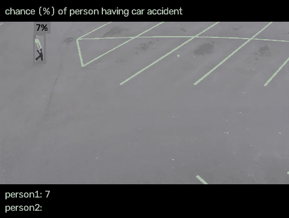

[English](README.md) | **中文**

# JEV Sees

### 给 JEV 一双眼睛。

**JEV 很会判断：快、结构化，而且天然适合做封闭式决策。唯一的问题是——官方的 JEV 还看不见。JEV Sees 就是把这块补上。**

把图片、视频流或者 RGB-D 相机接进来以后，JEV 就可以直接参与视觉世界里的判断：识别目标、估计风险、给状态打分，或者一次判断画面里的多个对象。

**一帧画面，多个对象，一次 JEV 调用。**



> 上面的 Demo 里，同一个采样帧中所有可见行人的事故风险，都由一次 JEV 调用一起返回。

**JEV 负责判断，JEV Sees 让它看见，[JEV Control](https://github.com/CharlesFeng0314/JEV_control_your_roboarm) 让它行动。**

---

## 为什么要给 JEV 加上视觉？

JEV 原本就很擅长一件事：**快速、封闭、结构化地做判断**。

choice、probability、score，这些结果很适合直接交给程序继续执行。

但没有视觉之后，很多本来很自然的问题就根本问不了：

- 这个行人现在危险吗？
- 机器人应该关注哪个物体？
- 目标的状态有没有发生变化？
- 画面里哪个对象最符合这个条件？
- 能不能把同一个问题一次问给这一帧里的所有人？

JEV Sees 做的就是把这扇门打开。

它让相机成为 JEV 的输入，让 JEV 不只是在文字或结构化信息上做判断，而是开始直接参与真实视觉场景里的决策。

### 和 VLM 的区别，不在于“谁会看图”

VLM 当然会看图，而且非常擅长开放式视觉理解：描述画面、解释场景、回答宽泛问题。

JEV 更有意思的地方，是当你的问题已经很明确时，你可以把视觉判断做得**更快、更结构化、更适合重复调用，也更适合并发处理很多个对象**。

| 常见 VLM 用法 | JEV Sees + JEV |
| --- | --- |
| “描述一下发生了什么” | “这一帧里每个行人危险吗？” |
| 自由文本生成 | choice / probability / score |
| 一次问一个大问题 | 一次塞进很多个封闭式问题 |
| 结果主要给人看 | 结果可以直接给程序用 |
| 更适合开放式理解 | 更适合持续重复做决策 |

这也是为什么给 JEV 加上视觉以后，它的使用空间会一下子变大：视频、机器人、监控、自动化测试、实时决策，都会变得很自然。

---

## 它能拿来问什么？

只要你的问题可以写成一个封闭式判断，就可以交给 JEV。

### 识别：这辆巴士是什么颜色？

```python
from jev_sees import Choice, Sees, TypeSafeClient

question = "What color is the bus?"
sees = Sees()
sees.observe("assets/bus.jpg")

with TypeSafeClient() as client:
    response = client.system_one(
        state=sees.state(question),
        questions={
            "bus_color": Choice(
                instructions=question,
                criteria={"yellow": None, "red": None, "blue": None, "uncertain": None},
            )
        },
    )

print(response.choices["bus_color"].choice)
# blue
```

`JEV Sees` 只负责生成 `state`。`Choice`、`system_one` 调用和 response 全部保持 `typesafe-sdk` 的官方写法。

### 概率：这个对象现在危险吗？

```python
from jev_sees import Noul

question = "Is object_003 in immediate danger from a vehicle?"
state = sees.state(question)

with TypeSafeClient() as client:
    response = client.system_one(
        state=state,
        questions={"in_danger": Noul(instructions=question)},
    )

print(response.nouls["in_danger"].noul)
# “yes”的概率
```

### 一次判断画面里的多个对象

```python
questions = {
    obj["object_id"]: Noul(
        instructions=f"Is {obj['object_id']} in immediate danger from a car?"
    )
    for obj in tracks
    if obj["label"] == "person"
}

with TypeSafeClient() as client:
    response = client.system_one(state=sees.state("Pedestrian risk"), questions=questions)
```

每个行人仍然是一道有名字的官方 `Noul`，结果直接从 `response.nouls[object_id]` 读取。

---

## Quick Start

### 1. 安装

```bash
git clone https://github.com/CharlesFeng0314/JEV_sees.git
cd JEV_sees
python -m pip install -e .
```

需要 Python 3.10+。

### 2. 配置 JEV API Key

到 [console.typesafe.ai/keys](https://console.typesafe.ai/keys) 创建一个 key。

macOS / Linux：

```bash
export TYPESAFE_API_KEY="your-key"
```

PowerShell：

```powershell
$env:TYPESAFE_API_KEY = "your-key"
```

官方 `TypeSafeClient` 和视频高级入口都可以读取这个 key；`observe()` 与 `state()` 本身仍然只是本地视觉流程。

### 3. 跑最小示例

```python
from jev_sees import Choice, Sees, TypeSafeClient

question = "What color is the bus?"
sees = Sees()
sees.observe("assets/bus.jpg")
with TypeSafeClient() as client:
    response = client.system_one(
        state=sees.state(question),
        questions={
            "bus_color": Choice(
                instructions=question,
                criteria={"yellow": None, "red": None, "blue": None, "uncertain": None},
            )
        },
    )
print(response.choices["bus_color"].choice)
```

仓库自带图片上的预期结果：

```text
blue
```

完整代码：[examples/bus_color.py](examples/bus_color.py)

---

## 感知、跟踪和场景记忆

`observe()` 是 JEV Sees 的本地视觉层：

```python
tracks = sees.observe("assets/bus.jpg")

for obj in tracks:
    print(obj["object_id"], obj["label"], obj["bbox_xyxy"])
```

每个被跟踪的对象会带上一组可以继续被程序使用的信息，例如：

```text
object_id
label
confidence
bbox_xyxy
centroid_uv
attributes.color_evidence.cv
attributes.color_evidence.clip
attributes.color_evidence.caption
```

颜色在 state 中是证据，不是 SDK 提前拍板的答案。CV 分支保留像素测量，CLIP 保留完整颜色概率分布，Florence 的原始 region caption 也会一同保留。JEV 可以据此判断三路结果是否一致，而不是只收到一个预选颜色字符串。

连续处理视频帧时，JEV Sees 会尽量维持稳定的 object ID，并维护 scene memory。这样同一个视觉问题就可以持续跟着“同一个对象”走，而不是每一帧都重新认识整个世界。

场景里还可以继续带上：

- 当前哪些对象可见
- 之前见过哪些对象
- 某个历史对象是不是已经 stale
- 两个框是否重叠、间距多大
- 两个对象中心点距离
- 相邻对象是否正在靠近
- RGB-D 下的三维位置与物体间实际距离

这些属于实现层细节。真正重要的是它带来的产品效果：**JEV 可以持续对一个变化中的视觉场景做结构化判断。**

---

## 支持哪些问题类型？

`jev_sees` 会直接重新导出官方的 `Choice`、`Noul`、`Score` 和 `TypeSafeClient`，因此只需要一行 import。它们仍然是 `typesafe-sdk` 的原始类；直接调用仍写 `client.system_one(...)`，输出仍从 `response.choices`、`response.nouls` 和 `response.scores` 读取。

JEV Sees 不会根据自然语言猜问题类型，也不会把 list 或 dict 转成 JEV question。应用必须自己构造官方 question object。处理视频时，`questions=` 可以接收一个函数：它拿到当前 tracked objects，再返回官方 questions 映射。

---

## 视频：每个行人一个风险

[examples/traffic_relations.py](examples/traffic_relations.py) 仍把抽帧、跟踪、绘制和输出格式放在 SDK 内部。示例里很短的 `questions()` 属于应用代码：它为当前 tracked objects 构造官方 `Noul`。JEV Sees 内部没有 traffic plan，也不会分析 prompt 后擅自生成问题。

运行：

```bash
python examples/traffic_relations.py
```

这个示例会调用 JEV，因此需要 `TYPESAFE_API_KEY`。

视频来源与授权：[assets/CREDITS.md](assets/CREDITS.md)

---

## RGB-D：不只相信 2D 检测框

RGB 模式从 Florence-2 dense-region caption 开始。Florence 自己发现区域、拉框并生成自由文本标签，调用者不传物体 vocabulary。

RGB-D 模式则换了一条路线：

**先用深度聚类决定“这里到底有没有一个物体”，再用与它重叠的 Florence region 提供自由文本名称。**

这件事的价值很直接：即使 2D detector 漏掉一个真实存在的物体，深度仍然可能把它从空间里“捞出来”。

| | | |
| --- | --- | --- |
|  |  |  |

如果同时传入相机内参，RGB-D 观测还可以得到 `position_m`，于是场景里不只有“它在图片哪里”，还可以有**米制三维位置和物体间距离**。

---

## 性能

以前的 YOLO benchmark 已经不能代表 Florence-2 pipeline，因此当前文档不再引用那组延迟。这个后端需要重新做图片与视频 benchmark 后才能发布性能结论。

---

## 模型与权重

权重没有直接放进仓库。

Florence-2 会在第一次使用时从 Hugging Face 加载。默认模型是 `microsoft/Florence-2-base-ft`；也可以替换兼容 checkpoint：

```python
Sees(florence_model="microsoft/Florence-2-large-ft")
```

如果 `JEV_SEES_ROBO_ROOT` 指向的目录里已经有：

```text
weights/clip/ViT-B-32.pt
```

JEV Sees 会把这份本地 CLIP 权重用于颜色证据；否则 CLIP 会在第一次使用时下载权重。

---

## 常见问题

如果：

```bash
python -c "import jev_sees"
```

报错，最常见的原因不是 JEV Sees 本身，而是你刚才运行 `pip` 的 Python 环境和现在这个 `python` 不是同一个。

建议始终用：

```bash
python -m pip install -e .
python -c "import jev_sees; print(jev_sees.__version__)"
```

这样安装和运行一定走同一个解释器。

测试：

```bash
python -m unittest discover -s tests -v
```

---

## JEV Family

JEV Sees 背后的想法其实很简单：**JEV 不应该只停留在文字世界里。**

给它眼睛，它就能判断眼前发生的事。
再给它双手，这些判断就可以变成真实动作。

```text
              JEV
          结构化判断
           /       \
          /         \
    JEV Sees     JEV Control
       眼睛           双手
       视觉          机器人动作
```

- **JEV Sees**：让 JEV 接收图片、视频和 RGB-D 相机输入
- **[JEV Control Your Roboarm](https://github.com/CharlesFeng0314/JEV_control_your_roboarm)**：把 JEV 的判断接到机械臂动作选择上

整个方向可以概括成一句话：

**see → judge → act**

---

## 当前状态

JEV Sees 目前是 **v0.1.0**，仍然是一个实验性项目。

对外接口仍然很小：`Sees(...)` 是图片/视频的产品级入口，`observe()` 和 `state()` 则把视觉层暴露给官方 JEV 调用。JEV 的官方类只做原样重新导出。底层视觉方案、scene representation、示例和 benchmark 都还会继续迭代。

如果你把它接到了另一台相机、另一种机器人，拿去看一个很奇怪的场景，或者想出了当前示例完全没覆盖的用法，欢迎直接开 Issue / Discussion。

**这个项目现在最需要的，不是更多“看起来完整”的文档，而是更多人真的拿去玩。**

---

## License

MIT
