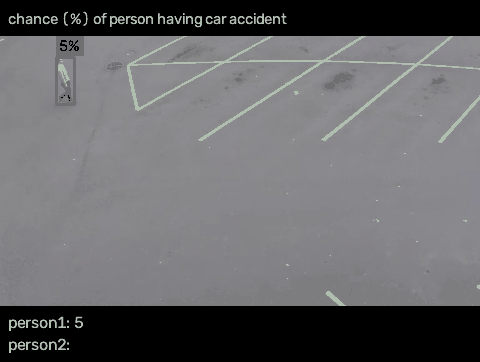
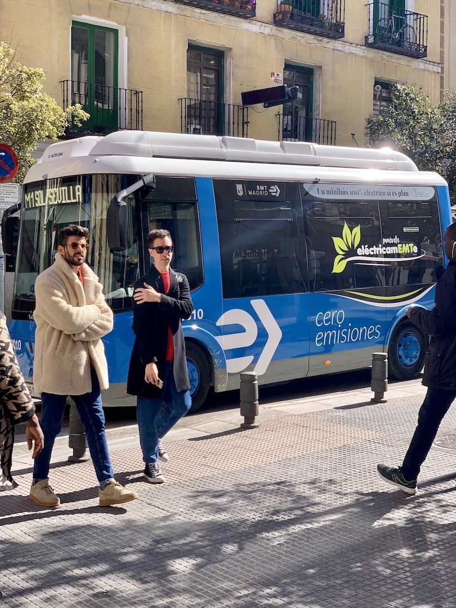

[English](README.md) | **中文**

# JEV Sees

**一帧画面，或者一整段视频，直接问 JEV。**

巴士是什么颜色。每个行人此刻出事的概率是多少。一张图，一次问完。一段视频里，每个行人各算一个数，同一次调用一起回来。



这是 [JEV Control Your Roboarm](https://github.com/CharlesFeng0314/JEV_control_your_roboarm) 的相机。眼睛在这里，手留在那边。

- 图片：一个封闭问题，一个答案
- 视频：每个行人一个概率，一次问完
- 彩色，或者彩色加深度

## 跑起来

```bash
pip install -e .
```

到 [console.typesafe.ai/keys](https://console.typesafe.ai/keys) 点 **Create key**，起个名字，立刻复制。密钥只显示一次。不要写进源码，不要提交到 git。

当前这个 PowerShell 窗口：

```powershell
$env:TYPESAFE_API_KEY = "粘贴你的密钥"
```

关掉窗口就没了。想留下来，就在**你执行命令的那个目录**放一个 `.env`。本仓库已经忽略这个文件。

```text
TYPESAFE_API_KEY=粘贴你的密钥
```

也可以写进代码：`Sees(api_key="粘贴你的密钥")`。三种里有一种就行。传了 `api_key` 就用它；没传就看环境变量；还没有，再读当前目录的 `.env`。

装包和跑示例必须是同一个 Python。先试：

```bash
python -c "import jev_sees"
```

这里报错，就是你敲的 `python` 不是刚才 `pip` 用的那个。换成那个解释器的完整路径，再跑下面的例子。

```python
from jev_sees import Sees

sees = Sees()
result = sees(
    "assets/bus.jpg",
    "What color is the bus?",
    ["yellow", "red", "white", "blue", "black", "uncertain"],
)
print(result.choice, result.confidence)
```

```text
blue 1.0
```

一段视频里把每个行人都问掉，一个字典就是一次调用。`{"yes": "...", "no": "..."}` 的返回值是概率：

```python
risks = sees.ask(
    "Each question is one pedestrian.",
    {
        "object_001": {
            "yes": "object_001 is in a car accident or a car is about to hit them",
            "no": "object_001 is clear of every car",
        },
    },
)
print(risks.answers["object_001"].noul)
```

- 列表，或 `{标签: 说明}`，是选择题
- `"yes/no"` 或 `{"yes": "...", "no": "..."}`，是是否题
- 元组，或 `{"rubric": ["...", "..."]}`，是打分
- 这些值组成的字典，是一次调用里的多道题

单题看 `result.choice`。多题看 `result.answers`。视频示例：[`examples/traffic_relations.py`](examples/traffic_relations.py)。

## 看看效果

**这辆巴士是蓝的。** [`examples/bus_color.py`](examples/bus_color.py)，图在 [`assets/bus.jpg`](assets/bus.jpg)。没有密钥也会先把框打出来。有密钥，JEV 回答 `blue`，置信度 1.0。



**路上每个行人，实时一个概率。** [`examples/traffic_relations.py`](examples/traffic_relations.py) 读 [`assets/traffic.mp4`](assets/traffic.mp4)。上面那条 GIF 就是它跑出来的。来源在 [`assets/CREDITS.md`](assets/CREDITS.md)。

## 快在哪里

RTX 4070 Ti SUPER，预热一次之后。原始记录：[`docs/pipeline_benchmark.json`](docs/pipeline_benchmark.json)。


只出框大约 20 ms。带上颜色的完整路径，`bus.jpg` 上 92 ms，巴士被写成蓝色。更大的 YOLOv8l 并没有更快，所以默认用 YOLOv8s。

| | YOLOv8s 只出框 | YOLOv8s 管线 | YOLOv8l 只出框 | YOLOv8l 管线 |
| --- | --- | --- | --- | --- |
| bus.jpg | 巴士 + 4 人，19.5 ms | 巴士写成蓝，92.4 ms | 巴士 + 4 人，18.8 ms | 98.7 ms |
| zidane.jpg | 2 人，20.8 ms | 102.9 ms | 2 人，22.0 ms | 98.2 ms |

深度相机上，有几个物体由深度决定，名字由 CLIP 给出。第 13 帧检测器一个名字都没有，管线仍然给出四个物体。

| | | |
| --- | --- | --- |
|  |  |  |

| 帧 | 深度团块 | YOLOv8s，置信度 0.25 | 团块 + CLIP + YOLO-l |
| --- | --- | --- | --- |
| 6 | 5 个，230.4 ms | 1 个汤罐头，11.4 ms | 5 个物体，378.9 ms |
| 13 | 4 个，246.5 ms | 没有，12.6 ms | spoon、cube、water bottle、cracker box，408.4 ms |
| 15 | 5 个，209.4 ms | 1 个汤罐头，10.9 ms | 5 个物体，388.2 ms |

## 权重

权重不在这个仓库里。`JEV_SEES_ROBO_ROOT` 指到一份已经有 `models/benchmark/yolov8s-worldv2.pt` 和 `weights/clip/ViT-B-32.pt` 的目录，就用那两份。否则第一次运行时 Ultralytics 和 CLIP 会自己下载。换模型用 `yolo_model=`。

没有密钥也能 `observe`，拿到 `object_id` 和框。`ask` 才要密钥。

```bash
python -m unittest discover -s tests -v
```
